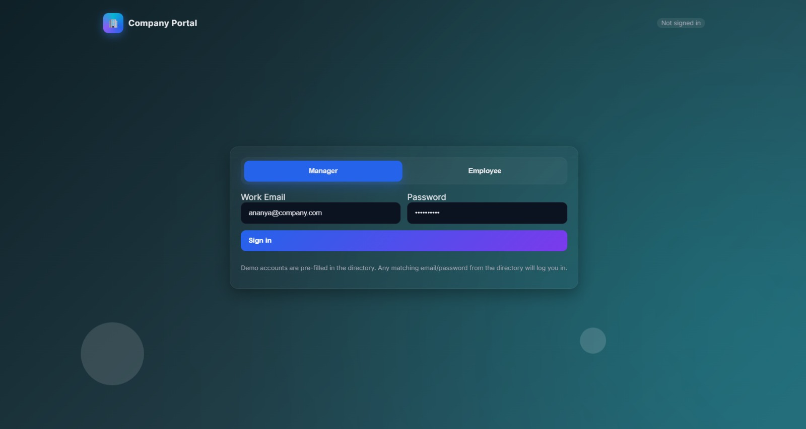
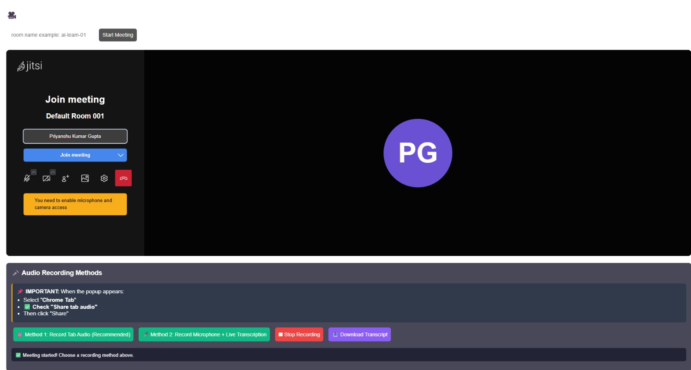
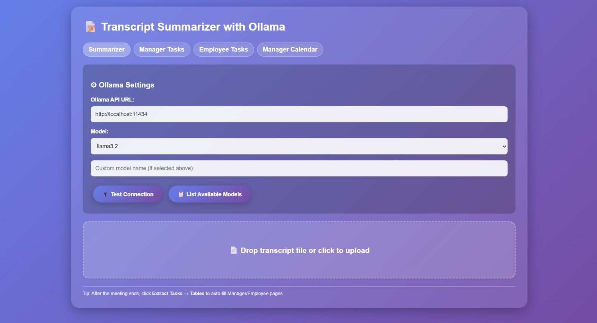

# 🚀AI-Powered-Meeting-And-Task-Management-Portal

An **AI-powered collaboration platform** designed to help organizations conduct meetings, extract insights, and manage employee tasks efficiently.

The system combines **online meetings, speech transcription, AI summarization, and task management** into one unified web application.

Managers can conduct meetings and assign tasks, while employees can track their assignments, receive AI-generated instructions, and submit work reports.

---

# 🌟 Project Overview

Modern companies rely heavily on online meetings and collaborative tools.
However, meetings often produce large amounts of information that are difficult to track.

This project solves that problem by providing:

* Meeting system with recording
* Speech-to-text transcription
* AI-based meeting summarization
* Automatic task extraction
* Task tracking dashboard
* Calendar-based task management

The system improves **team productivity and decision tracking**.

---

# 🧑‍💼 User Roles

The system supports two main roles.

## Manager

Managers control meetings and assign tasks.

Capabilities include:

* Start and manage meetings
* Assign tasks to employees
* Track task progress
* View employee information
* Monitor performance
* Manage deadlines
* View tasks in calendar

---

## Employee

Employees work on tasks assigned by the manager.

Capabilities include:

* View assigned tasks
* Update task status
* Generate AI instructions
* Write task execution steps
* Export reports
* Export presentations

---

# 🎥 Online Meeting System

The platform integrates **Jitsi Meet** for video meetings.

Features include:

* Create meeting rooms
* Join meetings instantly
* Record meeting audio
* Record tab audio
* Record microphone audio
* Download meeting recordings
* Generate live transcription
* Download transcript files

This system helps teams **capture meeting discussions automatically**.

---

# 🎤 Speech Transcription

During meetings, speech is converted to text using:

**Web Speech Recognition API**

This enables:

* Real-time transcription
* Timestamped meeting records
* Downloadable transcript file

Example transcript:

```
[10:12:04] We need to update the sales report.
[10:12:09] Priyanshu will prepare the presentation.
[10:12:15] Deadline is Friday.
```

---

# 🧠 AI Transcript Summarization

The system includes an **AI-powered summarizer** that processes meeting transcripts.

Using **Ollama local LLM models**, it can:

* Generate meeting summaries
* Identify action items
* Extract tasks automatically
* Convert discussions into structured information

Available summary styles:

* Brief summary
* Detailed summary
* Bullet point summary
* Action items
* Q&A format

---

# 🧩 Automatic Task Extraction

The system can detect tasks directly from meeting transcripts.

Example:

Transcript:

```
Tejas should prepare the UI design.
Deadline is Monday.
```

Extracted Task:

| Task              | Assignee | Deadline |
| ----------------- | -------- | -------- |
| Prepare UI design | Priyanshu| Monday   |

This reduces manual task tracking.

---

# 📊 Task Management System

Managers can manage tasks using a dashboard.

Each task contains:

* Task title
* Assigned employee
* Deadline
* Task description
* Task status

Statuses include:

* Assigned
* In Progress
* Blocked
* Completed

Managers can also:

* Bookmark tasks
* Update deadlines
* Mark tasks completed

---

# 📅 Task Calendar

The portal includes a **visual calendar** for tracking tasks.

Managers can:

* See tasks by date
* View upcoming deadlines
* Track workload distribution
* Monitor team progress

---

# 📄 Report Generation

Employees can export task results as documents.

Supported formats:

### PDF Report

Generated using **jsPDF**

### PowerPoint Presentation

Generated using **PptxGenJS**

This feature helps employees create **presentation-ready reports** quickly.

---

# 📸 Project Screenshots

## Login Page



---

## Manager Dashboard


---

## Meeting System



---

## AI Transcript Summarizer



---

# 🖥️ Technologies Used

## Frontend

* HTML5
* CSS3
* JavaScript

## Libraries

* Jitsi Meet API
* jsPDF
* PptxGenJS

## Browser APIs

* Web Speech Recognition API
* MediaRecorder API
* LocalStorage API

## AI Integration

* Ollama Local LLM

Supported models include:

* llama3
* mistral
* qwen
* custom LLM models

---

# 📂 Project Structure

```
company-portal
│
├── index.html
├── meeting.html
├── summarizer.html
├── login.jpeg
├── manager dashboard.jpeg
├── meeting.jpeg
├── summerizer.jpeg
└── README.md
```

---

# 🔐 Demo Login Credentials

Manager login

Email

```
ananya@company.com
```

Password

```
manager123
```

---

Employee login password format

```
firstname123
```

Example

Email

```
priyanshu@company.com
```

Password

```
priyanshu123
```

---

# 💾 Data Storage

The current version stores data using:

**Browser LocalStorage**

Advantages:

* No backend server required
* Works offline
* Easy to deploy

---

# 🔮 Future Improvements

Possible upgrades include:

* Backend integration using **Node.js / Java**
* Database integration (MySQL / MongoDB)
* Real-time chat system
* Email notifications for tasks
* AI meeting analytics
* Cloud deployment
* Authentication system

---

# 👨‍💻 Author

Priyanshu Kumar Gupta

---

# 🎯 Project Purpose

This project demonstrates important modern development concepts including:

* AI-powered workplace tools
* Meeting intelligence systems
* Speech recognition
* Task automation
* Role-based dashboards
